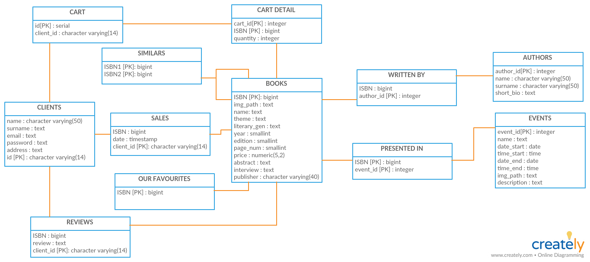

# Documentation of the Backend part
> Deliverable D1
## General group information
| Member n. | Role | First name | Last Name | Matricola | Email address |
| --------- | ------------- | ---------- | --------- | --------- | --------------- |
| 1 | administrator | Andres | Salas Peña | 915713 | asalaspena@gmail.com |
| 2 | member | Marcelo | Iturriaga Dewulf | 918113 | muiturriaga@uc.cl |
| 3 | member | Luca | Colombo | 808637 | luca48.colombo@mail.polimi.it
## Links to other deliverables
- Deliverable D0: the web application is accessible at
[this address](https://hypermedia-bookshop.herokuapp.com/).
- Deliverable D2: the YAML or JSON file containing the specification of the app
API can be found at [this address](https://hypermedia-bookshop.herokuapp.com/api/swagger.yaml).
- Deliverable D3: the SwaggerUI page of the same API is available at
[this address](https://hypermedia-bookshop.herokuapp.com/docs).
- Deliverable D4: the source code of D0 is available as a zip file at
[this address](https://hypermedia-bookshop.herokuapp.com/backend/source.zip).
- Deliverable D5: the address of the online source control repository is
available [this address](https://github.com/andressp05/Hypermedia). We hereby declare that this
is a private repository and, upon request, we will give access to the
instructors.
## Specification
### Web Architecture
Describe here, with a diagram, the components of your web application and how
3
they interact. Highlight which parts belong to the application layer, data layer
or presentation layer. How did you ensure that HTML is not rendered server side?
### API
#### REST compliance

##### Describe here to what extent did you follow REST principles and what are the reasons for which you might have decided to diverge.
We Followed these REST principles:

- **Client-server**: The client and the server are separated in our application. Infact the client uses static html pages to display the information to the user, these information are gathered with javascript fetches operated by the scripts inside the static pages that call the web services reachable through the `/api` address.
- **Statless**: Because the server is not storing anything about past client's requests.
- **Uniform interface** :
- **Layered system**: Despite we used only one layer the client can not tell if it is connecting to the end server or to a proxy.

We didn't follow these REST principles:
- **Cacheable**: Because we didn't had the need to cache anything server side.

#### OpenAPI Resource models
##### Describe here synthetically, which models you have introduced for resources.

We have introduced these models:

**Book** that contains all the information related to a book.
 
**Author** that contains all the information related to a book.
 
**Cart** that contains the information of the cart for the user, the books selected by the user and the related quantity.
 
**Review** that contains the review from a user to a book.

### Data model
Describe with an ER diagram the model used in the data layer of your web
application. How these map to the OpenAPI data model?

## Implementation
### Tools used

The server is developed using NodeJS technology and with PostgreSQL as database. The database is accessed from the server through an [ORM](https://knexjs.org/).

To parse the handle the REST endpoint structure we used the middleware [swagger-tools](https://www.npmjs.com/package/swagger-tools).

We used the [bcrypt](https://www.npmjs.com/package/bcrypt) package to encrypt the user password on the database.

[shortid](https://www.npmjs.com/package/shortid) was used to generate unique ids to identify the users on the database.

[express](http://expressjs.com/) was used as a middleware to listen for requests from the client and serve static files.

[cookie-session](http://expressjs.com/) was used to save the login information required for authenticating the requests on the client through the cookies.
### Discussion
Describe here:
- How did you make sure your web application adheres to the provided OpenAPI
specification?

We have followed an approach "OpenAPI specification first" in which we firstly developed the web services specifications and validated them, then in a second phase we wrote the server code to use the specification already written.
  
- Why do you think your web application adheres to common practices to partition
the web application (static assets vs. application data)

Because we developed the server side and the client side at the same time just using as a reference the OpenAPI specification of our web services. The client uses only static pages and calls the web services of the server to fetch the data needed using the html file as a template for the layout.
  
- Describe synthetically why and how did you manage session state, what are the
state change triggering actions (e.g., POST to login etc..).

The session state changes only when a user uses the `/api/user/...` endpoints. These are used to authenticate the following requests of a user. The user receives a cookie containing the information needed to authenticate his requests when accessing private resources for example his shoping cart.
  
- Which technology did you use (relational or a no-SQL database) for managing
the data model?

To manage the data model we used only [PostgreSQL](https://www.postgresql.org/) which is a relational database.
## Other information

### Task assignment
Describe here how development tasks have been subdivided among members of the
group, e.g.
- Marcelo worked on front end design and development(49% of the time), on the database structure (10%) back end development (40%), back end documentation (1%)
- Andres worked on front end design and development (40% of the time), on the database structure (5%), on the usability documentation (35% of the time), on the design documentation (19% of the time) and on back end documentation (1%).

### Analysis of existing A
4
Describe here if you have found relevant APIs that have inspired the OpenAPI
specification and why (at least two).

We've been inspired by [reddit](https://www.reddit.com/) API to use the cookie as a storage for the user tokens. 
And from [OpenWeatherMap's API](https://openweathermap.org/api) we learned how to create proper requests to the web services.

### Learning outcome
What was the most important thing all the members have learned while developing
this part of the project, what questions remained unanswered, how you will use
what you've learned in your everyday life?

- Marcelo has improved his HTML and CSS programming skills, he learn to develop an complete application, also learned about nodejs, npm and nvm, he has also learned JS, jQuery handling and responsive design using Bootstrap. He would like to learn more about React, Vue and Webpack to learn how to do faster and better webapps mixing client-side and server-side libraries.
- Andres has improved his HTML, javascript and CSS programming skills, in fact he learns a lot about taking advantages of using Bootstrap templates. He also learned about nodejs and npm, and about how to deploy an app with heroku and he continues managing SQL as usual. He would like to learn more about the angular js. He has learned that the documentation part of ussability and design is super dense and also its results are the key to know if you have done a good website or not.
